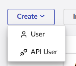
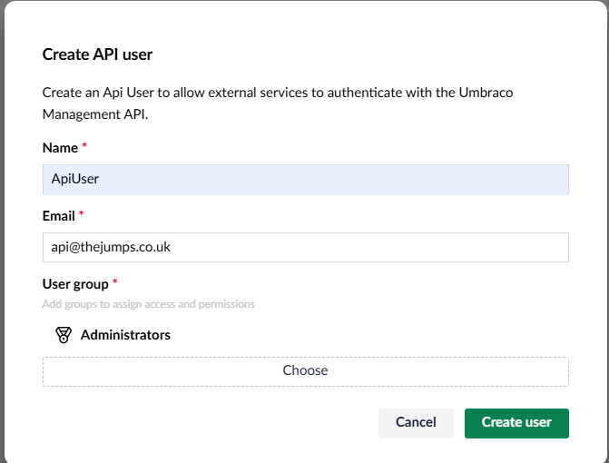
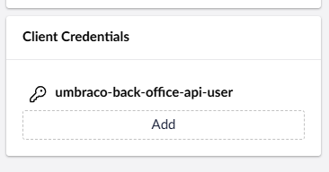

# uSync Command Line library

### uSync command line for Umbraco v15+

This is the v15 version of the uSync command line util, it uses the ManagementAPI (and the uSync Maanagement API) to do the funky stuff without
you having to install anything on the server.

## Create an API user

In the users section of Umbraco



create the api user and add them to the relevant group



## Add a Client Secret and Key

Once you have created an API user , you will need to give them a client id and secret,



you will need both the client id and secret to connect via the command line.

## either add an appsetting.json or use the `-k` `-i` settings

you can add an appsettings.json to the root of the folder where
you are running the uSync command line:

```json
{
  "uSync": {
    "Command": {
      "Secret": "[CLIENT_SECRET]",
      "ClientId": "[CLIENT_ID]"
    }
  }
}
```

or you can pass these on the command line. eg.

```
usync-ping -s https://localhost:44359 -s [client_secret] -k [client_id]
```
